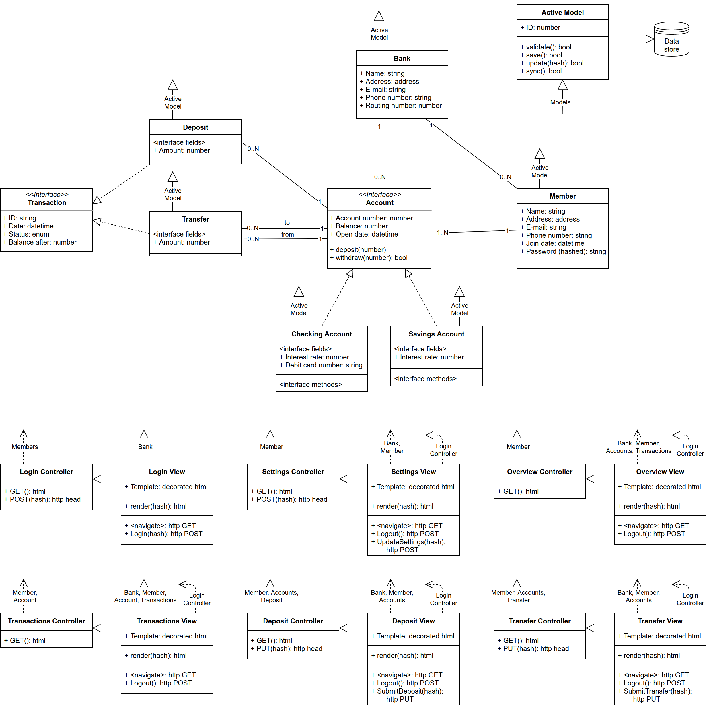
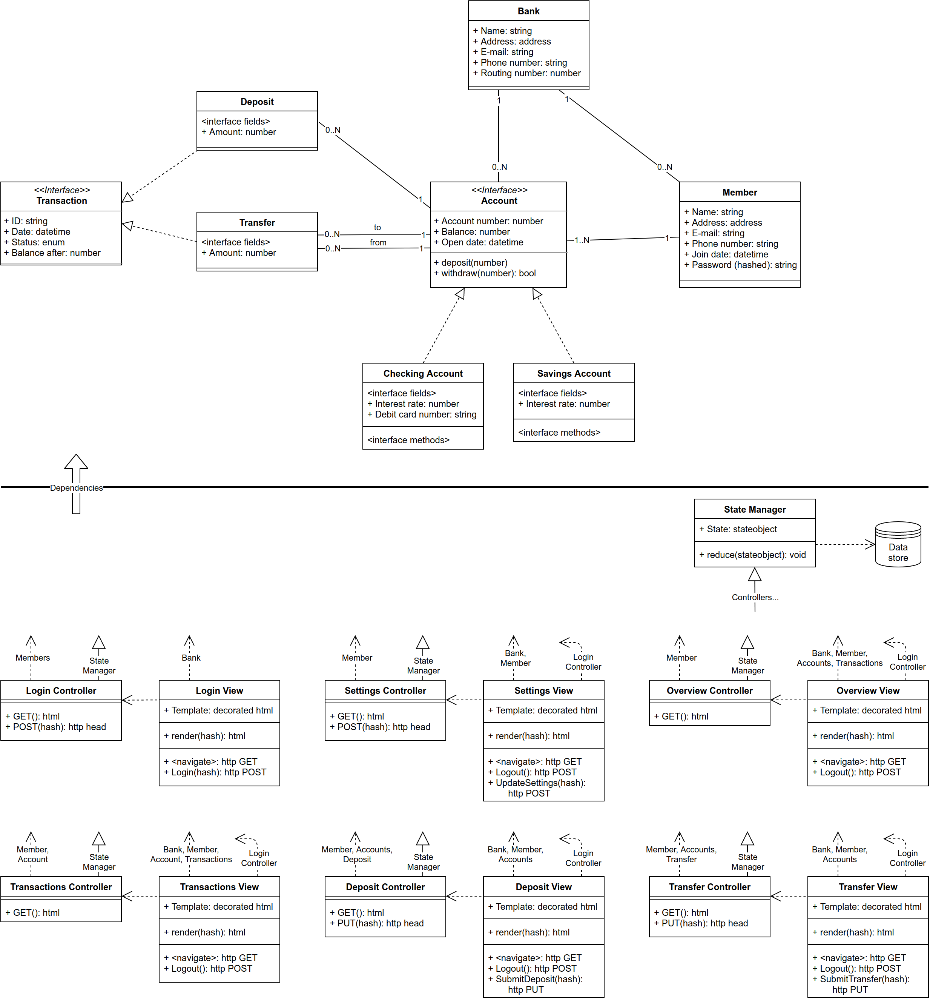
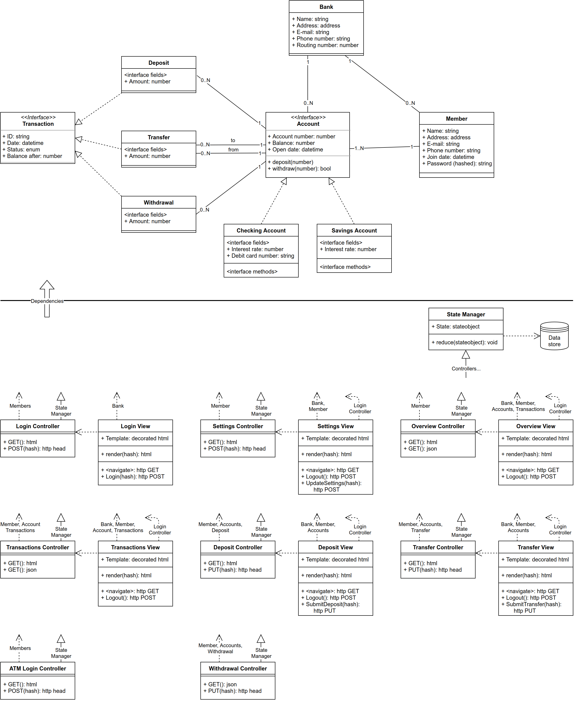

# Banking Software Design

Given the prototypical Model-View-Controller triad, design a simple banking application (e.g., check balance, deposit,
login, logout, transfer, ...) for the web using a UML Class diagram. Updated such that both the interface and storage
are plugins with specific boundaries, as described in "Uncle" Bob Martin's talk. Identify which portions of your class
diagram would have to be updated to support a hardware Automatic Teller Machine (ATM). Turn in the following:

- Your initial Model-View-Controller class diagram for the banking application and a (short) description of each class.
- Your updated class diagram based on "Uncle" Bob Martin's talk, as described above and a (short) updated description of
  any new or modified class.
- Your ATM class diagram and a (short) updated description of any new or modified class.
- Finally, please describe the benefits and any detriments of your proposed architecture and the generalized method used
  to derive the architecture. Bullet points for this are fine.

Note: Be sure to use appropriate
[relationships between the classes](https://en.wikipedia.org/wiki/Class_diagram#Relationships).

## Traditional MVC

<!-- Your initial Model-View-Controller class diagram for the banking application and a (short) description of each
     class -->

A note on View classes in the diagram. These classes have two _methods_ sections; the first is class methods in the
backend View class, and the second is the frontend actions this View is responsible for in the browser.

UML diagram:

Classes:

- Models
  - Active Model: parent class that manages synchronization with the external data store
  - Bank: contains the institution's basic information
  - Member: contains a user's basic information and password
  - Account _Interface_: defines an account-like entity that can be owned and participate in transactions
  - Checking Account: an account implementation that comes with a debit card
  - Savings Account: an account implementation that has a higher interest rate
  - Transaction _Interface_: defines a funds-transferring entity that affects account balances
  - Deposit: a transaction implementation that adds funds to an account
  - Transfer: a transaction implementation that moves funds from one account to another
- Controllers and Views (combined)
  - Login: render login page, handle credentials during login requests, and handle logout requests
  - Settings: render settings page, allow user to update their member information
  - Overview: render and link to the member's accounts; show and link to the 10 most recent transactions
  - Transactions: render all the transactions for a given account
  - Deposit: render deposit page, allow user to submit a deposit amount to one of their accounts
  - Transfer: render transfer page, allow user to submit a transfer amount between two of their accounts

## Plugin-oriented MVC

<!-- Your updated class diagram based on "Uncle" Bob Martin's talk, as described above and a (short) updated description
     of any new or modified class -->

"Uncle Bob"'s suggested pattern was Model-View-Presenter. This is still at least _called_ MVC in the diagram, but I
tried to move the data store out to the other side of the dependency line, so that it could be used as a plugin with
respect to the business logic (the models). I am learning the Redux pattern, and try to follow that here. The Redux-MVC
translation is shown here:

| Redux   | MVC               |
| ------- | ----------------- |
| View    | View HTML         |
| Action  | HTTP/AJAX request |
| Store   | Entire backend    |
| State   | Backend datastore |
| Reducer | Model logic       |

When a user requests a page, the Controller receives an immutable copy of the (relevant) state. The pass the state to
the View during rendering, and return the page. When the user submits and action (e.g. a PUTting a transfer), the
Controller receives an immutable copy of the state, and applies the appropriate model functions to this state, and
produces a new state, which is reduced into the data store. The backend responds with success or error, and the view
reflects this new state.

UML diagram:

Classes:

- Models: no longer inherit from Active Model
- Controllers: inherit from State Manager, which loads an immutable copy of the current state and reduces a copy of new
    state

## Adding an ATM

<!-- Your ATM class diagram and a (short) updated description of any new or modified class -->

UML diagram:

Classes:

- Models
  - Withdrawal: a transaction implementation that subtracts funds from an account
- Controllers
  - Overview and Transactions: add JSON GET method to support communication with ATM
  - ATM Login: add separate login controller for ATMs, as they are likely to use different credentials on not use
        browser cookies for session management
  - Withdrawal: allow user to withdraw funds from one of their accounts

## Advantages and Disadvantages of the Architecture

<!-- Finally, please describe the benefits and any detriments of your proposed architecture and the generalized method
     used to derive the architecture. Bullet points for this are fine -->

- Benefits of this Architecture
  - The business logic has no outbound dependencies
  - The business logic is pure, and therefore can be thorough and quickly tested (no test DB!)
  - Adding new transaction and account types is easy
  - Changing the views (almost always) doesn't change the controllers
  - Scalability due to state immutability
- Drawbacks
  - Most frameworks are traditional MVC, and making them work this way would take more effort
  - Changes eventually need to be reduced into a single authoritative state; it is clearer precisely how and when this
      happens in a frontend Redux application, but not in a backend application (i.e., where is the implementation of
      this State Manager? Maybe something like Datomic?)
  - How do you "apply the appropriate model functions to this state"? Are the models still class instances (possible
      when the state consists of actual objects in your language), or are they libraries of functions that operate on
      data?
